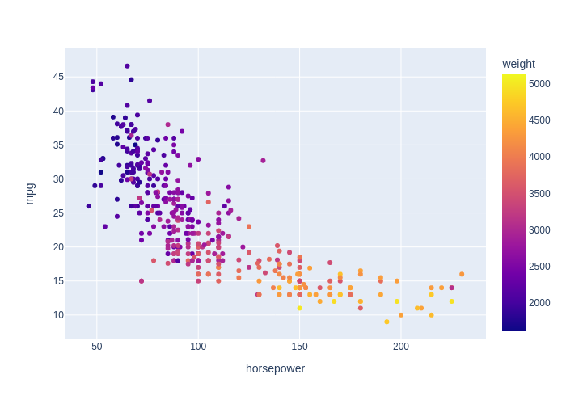

# Automobile Fuel Consumption Prediction

## Project Goal
The goal of this project is to experiment with various machine learning models in order to find one that best predicts the fuel consumption (in mpg) of late 1970's and early 1980's automobiles based on their specifications like cylinders, horsepower and weight.

**View the analysis [here](https://github.com/Vipul97/fuel-consumption-prediction/blob/main/fuel_consumption_prediction.ipynb).**

## Data Source
The dataset is available at https://archive.ics.uci.edu/ml/datasets/auto+mpg.

### Plot of MPG Against Horsepower, with Weight as Color 

## Results
**Random Forest Regression** gives the best results on the test data set, having the lowest root mean squared error of **0.90** and the highest R squared score of **0.92**.

|                     Model    |     RMSE     | R2 |
| ----------------------------:| :----------: | :-----------: |
| **Random Forest Regression** | **0.090160** | **0.917416**  |
|    Support Vector Regression |   0.094992   |   0.908327    |
|             Lasso Regression |   0.099277   |   0.899870    |
|                   ElasticNet |   0.099348   |   0.899726    |
|            Linear Regression |   0.099720   |   0.898974    |
|             Ridge Regression |   0.099918   |   0.898572    |
|               KNN Regression |   0.109128   |   0.879013    |
|     Decision Tree Regression |   0.133832   |   0.818035    |
